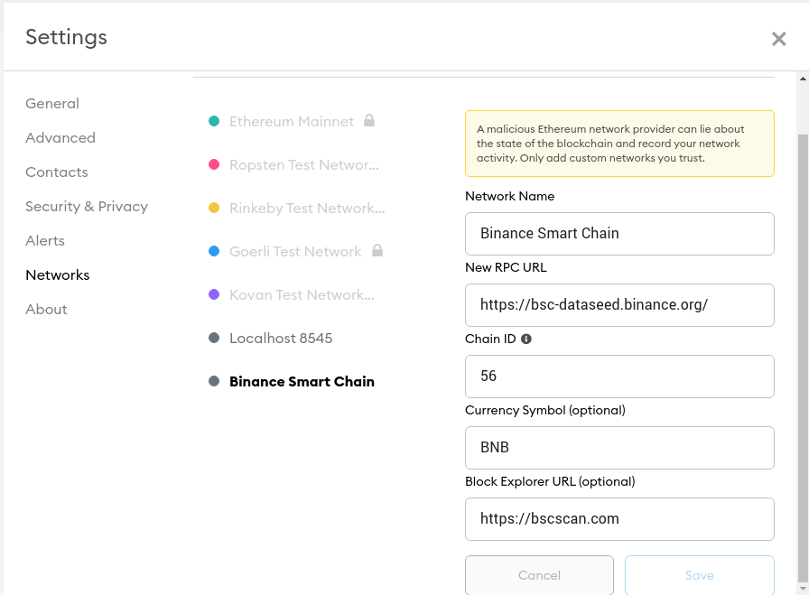

# Solidity
https://soliditylang.org/

https://docs.soliditylang.org/en/v0.8.2/solidity-by-example.html

# Accidently sent ETH with BEP20 transfer network

So, I accidently withdraw ETH from tokocrypto using BEP20 network.

by default, metamask is using ethereum mainnet.

to see your ETH, you have to add BSC (Binance Smart Chain) main network.

https://docs.binance.org/smart-chain/wallet/metamask.html

then add this token to your BSC wallet https://bscscan.com/token/0x2170ed0880ac9a755fd29b2688956bd959f933f8 by copying the contract address.

https://www.reddit.com/r/Metamask/comments/kooms2/sent_eth_as_bep20_in_the_binance_smart_chain_to/

https://metamask.zendesk.com/hc/en-us/community/posts/360073207331-Accidently-sent-ETH-with-BEP20-transfer-network
